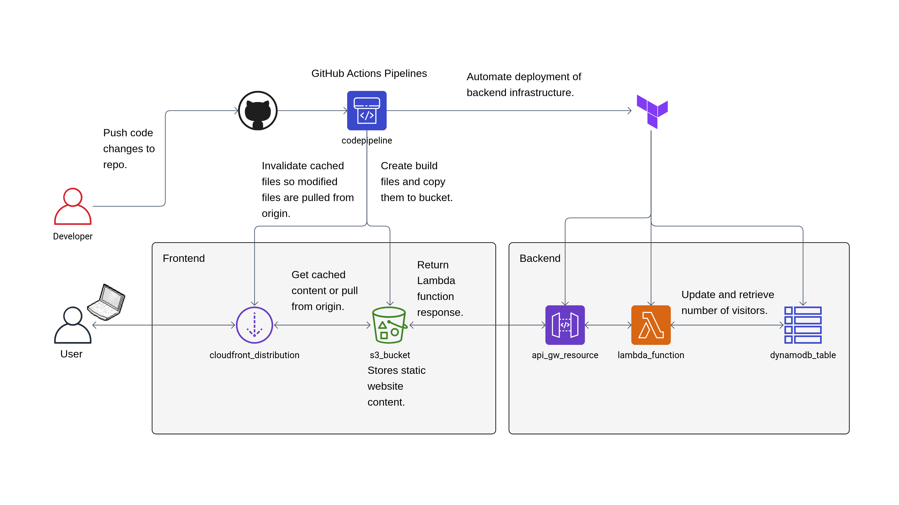

# Cloud Personal Website

This project aims to host my personal website on AWS. The idea for this project is based off the [Cloud Resume Challenge](https://cloudresumechallenge.dev/). The goal was to build and deploy a resume website using real cloud services while learning about CI/CD, infrastructure as code, serverless functions, and more.

NOTE: All infrastructure related to this project has been deleted and the AWS account has been closed. This code is for educational/demo purposes only. A video demo of this project can be found here: https://www.youtube.com/watch?v=ZbmAlki0HR8.

## Tech Stack and Cloud Services Used

- **Frontend**: React (compiled to static HTML/CSS/JS)
- **Hosting**: AWS S3 + CloudFront (for HTTPS)
- **Backend**: AWS Lambda (Python - handles visitor counter logic)
- **Database**: DynamoDB (stores number of visits)
- **API**: Amazon API Gateway (exposes Lambda as a REST endpoint)
- **CI/CD**: GitHub Actions (automated deployment pipeline)
- **Infrastructure as Code**: Terraform (provisioning all AWS resources)

## Architecture Diagram

> Static site is served via CloudFront with HTTPS. Backend Lambda counts page views and stores in DynamoDB. Each time the user visits the page, the function updates the visit count and returns the current number of visitors. CI/CD allows for code changes to be deployed automatically by updating the S3 bucket for the frontend and using Terraform for the backend.

## License

This project is open-sourced software licensed under the MIT license.
